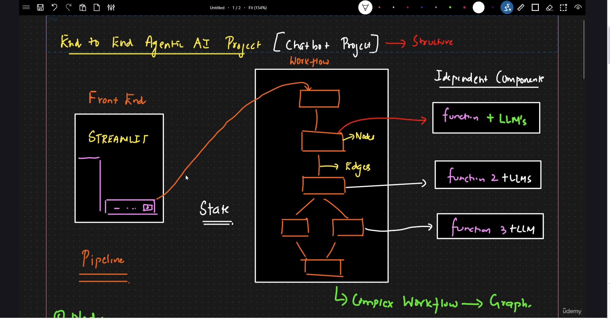
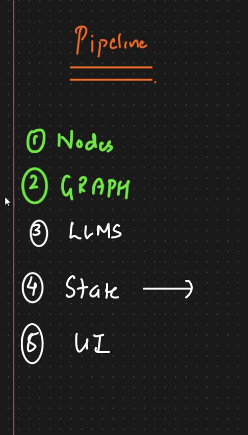

PROJECT Structcher 

1. create src folder inside we will devlop and write code for project wrt o main funionatlites    and inside this folder create __init__.py file we can also use this folder as pacage
2. another folder langgraph and same __init__.py
3. inside langgrpah file we will be create all components Nodes Graph State Tools LLM Ui
   with all __init__.py file
3.  call all the components from the frotnend create "main.py" file inside langgrpah folder
4. create app.py file outsied from langrpah/src foldre where we will be starting our exxecution

Project Setup & Folder Structure Guide

1. Create a project folder and virtual environment:
- mkdir project_name
- cd project_name
- python -m venv venv
- Activate:
Windows: venv\Scripts\activate
Mac/Linux: source venv/bin/activate

2. Create requirements.txt and install dependencies:
- Add libraries like langchain, fastapi
- pip install -r requirements.txt

3. Git setup:
- git init
- create .gitignore and README.md
- git add .
- git commit -m "Initial commit"
- git branch -M main
- git remote add origin https://github.com/mr-sam11/Agentic-Ai-Projects.git
- git push -u origin main

4. Folder structure:
- Create src folder with __init__.py
- Inside src, create langgraph folder with __init__.py

5. Inside langgraph create:
- nodes/
- graph/
- state/
- tools/
- llm/
- ui/ (optional)
(All folders should contain __init__.py)

6. Create main.py inside langgraph to connect all components.

7. Create app.py in root folder as entry point.